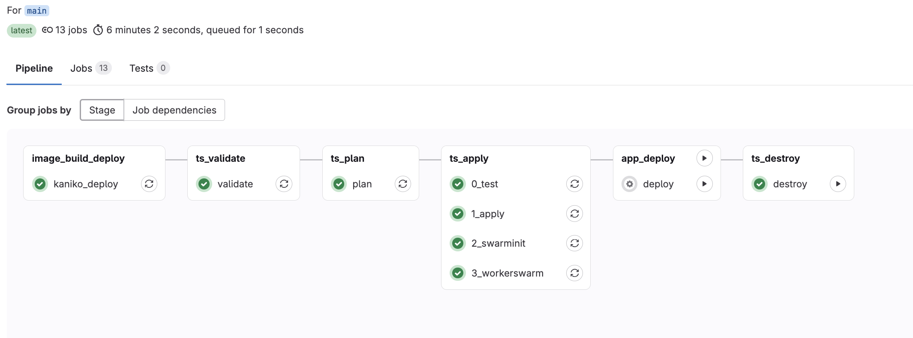

```yaml
image:
  name: hashicorp/terraform:light
  entrypoint:
  - '/usr/bin/env'
  - 'PATH=/usr/local/sbin:/usr/local/bin:/usr/sbin:/usr/bin:/sbin:/bin'

variables:
  DOCKER_FILE: monitoring/Dockerfile

stages:
- image_build_deploy
- ts_validate
- ts_plan
- ts_apply
- app_deploy
- ts_destroy

before_script:
- cd cluster
- pwd
- terraform init
- terraform --version

validate:
  stage: ts_validate
  script:
  - terraform validate

plan:
  stage: ts_plan
  script:
  - terraform plan 
  dependencies:
  - validate
  artifacts:
    paths:
    - planfile

0_test:
  stage: ts_apply
  image: python:3.9-slim-buster 
  before_script:
  - apt-get update && apt-get install -y jq curl ssh ca-certificates openssl git
  script: 
  - |
    WORKERIP=$(curl -s -H "Authorization: Bearer $HETZNER_KEY" 'https://api.hetzner.cloud/v1/servers' | jq -r '.servers[1].public_net.ipv4.ip')
    if [[ $WORKERIP == 'null' ]]; then
      echo "RUNNING=no" > build.env
    else
      echo "RUNNING=ok" > build.env
    fi
  artifacts:
    reports:
      dotenv: build.env

1_apply:
  stage: ts_apply
  script:
  - |
    if [[ $RUNNING == 'no' ]]; then
      terraform apply -auto-approve
    fi
  needs:
  - job: plan
    artifacts: true
  - job: 0_test
    artifacts: true
  #when: manual

2_swarminit:
  stage: ts_apply
  needs:
  - job: 1_apply
    artifacts: true
  image: python:3.9-slim-buster 
  before_script:
    - apt-get update && apt-get install -y jq curl ssh ca-certificates openssl git
    - chmod 400 $SSH_KEY
  script:
  - |
    MANAGERIP=$(curl -s -H "Authorization: Bearer $HETZNER_KEY" 'https://api.hetzner.cloud/v1/servers' | jq -r '.servers[] | select(.labels.role | contains ("manager")) | .public_net.ipv4.ip')
    MANAGERINTIP=$(ssh -o StrictHostKeyChecking=no -i $SSH_KEY devops@$MANAGERIP "hostname -I | cut -d ' ' -f2")
    ssh -o StrictHostKeyChecking=no -i $SSH_KEY devops@$MANAGERIP "
    docker swarm init --listen-addr ${MANAGERINTIP}:2377 --advertise-addr ${MANAGERINTIP}:2377 | grep SWM | sed 's/^[ \t]*//g'" > docker_join_worker.sh
    cat docker_join_worker.sh

  artifacts:
    paths:
    - docker_join_worker.sh
    expire_in: 1 week

3_workerswarm:
  stage: ts_apply
  needs:
    - job: 2_swarminit
      artifacts: true
  image: python:3.9-slim-buster 
  before_script:
    - apt-get update && apt-get install -y jq curl ssh ca-certificates openssl git
    - chmod 400 $SSH_KEY
  script:
  - |
    WORKERIP=$(curl -s -H "Authorization: Bearer $HETZNER_KEY" 'https://api.hetzner.cloud/v1/servers' | jq -r '.servers[] | select(.labels.role | contains ("worker")) | .public_net.ipv4.ip')
    cat docker_join_worker.sh | ssh -o StrictHostKeyChecking=no -i $SSH_KEY devops@$WORKERIP 

deploy:
  image: python:3.9-slim-buster 
  stage: app_deploy
  before_script:
  - apt-get update && apt-get install -y jq curl ssh ca-certificates openssl git
  - chmod 400 $SSH_KEY
  script:
  - |
    WORKERIP=$(curl -s -H "Authorization: Bearer $HETZNER_KEY" 'https://api.hetzner.cloud/v1/servers' | jq -r '.servers[1].public_net.ipv4.ip')
    ssh -o StrictHostKeyChecking=no -i $SSH_KEY devops@$WORKERIP "
    docker run -d milocloud/tsmonit:latest &&
    docker run -d -p 80:80 nginx"
  when: manual

destroy:
  stage: ts_destroy
  script:
  - terraform destroy -auto-approve
  dependencies:
  - plan
  when: manual

kaniko_deploy:
  stage: image_build_deploy
  image:
    name: gcr.io/kaniko-project/executor:debug
    entrypoint: [""]
  before_script:
    - AUTH=$(echo -n ${DOCKER_HUB_USER}:${DOCKER_HUB_PASSWORD} | base64)
    - cp -f "${CI_PROJECT_DIR}/monitoring/config.json" /kaniko/.docker/config.json
    - sed -i "s/PLACE_HOLDER/$AUTH/" /kaniko/.docker/config.json
  script:
    - |
      /kaniko/executor --context "${CI_PROJECT_DIR}/monitoring" --dockerfile "${CI_PROJECT_DIR}/${DOCKER_FILE}" --destination "milocloud/tsmonit:${CI_COMMIT_SHORT_SHA}" --destination "milocloud/tsmonit:latest"
```